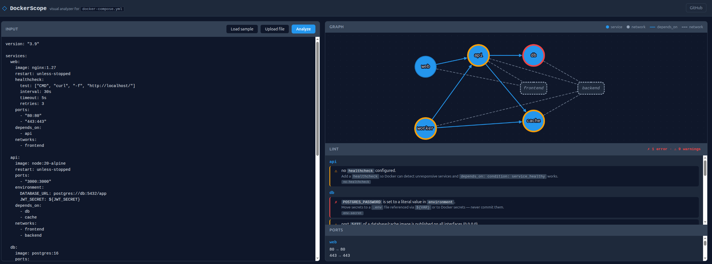

# DockerScope

> Visual analyzer for `docker-compose.yml` — paste a compose file, see the architecture.

### [Try the live demo →](https://dannyruizb.github.io/dockerscope/)



DockerScope is a **client-side, zero-backend** tool that parses a `docker-compose.yml` file and renders:

- A **service graph** showing dependencies (`depends_on`) and network membership.
- A **port table** listing every published port grouped by service.
- **Paste, upload, or drag & drop** your compose file — everything runs in the browser.

Future versions add a **static linter** that flags common bad practices (`image: latest`, secrets in `environment`, `0.0.0.0` exposure, missing `restart`, missing healthchecks, etc.) and **PNG/SVG export**.

🚧 Work in progress — v0.1.0.

---

## Why

Reviewing a `docker-compose.yml` from a teammate, a tutorial, or a homelab project usually means scrolling through YAML and building the architecture in your head. DockerScope flips that: paste the file, see the architecture.

It is intentionally **not** a wrapper around `docker compose config` — it runs entirely in the browser, so no Docker daemon, no upload, no server.

## Use it

Live demo: **https://dannyruizb.github.io/dockerscope/** — runs 100% in your browser, no upload, no server.

Run locally — any static server works:

```bash
git clone https://github.com/DannyRuizB/dockerscope.git
cd dockerscope
python3 -m http.server 8080
# open http://localhost:8080
```

> Opening `index.html` directly with `file://` works for pasted input but blocks `Load sample` (browsers disallow `fetch` from `file://`). Use a static server.

## Roadmap

- [x] **v0.1** — Parse compose, render service graph (`depends_on` + networks), list ports, file upload + drag & drop.
- [ ] **v0.2** — Static linter: `image: latest`, secrets in `environment`, `0.0.0.0`, missing `restart`, missing healthchecks.
- [ ] **v0.3** — Export graph to PNG / SVG.
- [ ] **v0.4** — Volumes as nodes; `extends` / `include` resolution.
- [ ] **v0.5** — `Dockerfile` analyzer: drop a `Dockerfile` next to the compose to surface base image, multi-stage builds, and `EXPOSE` / `ENV` / `CMD` per service.
- [ ] **v0.6** — Stack detection from `package.json` / `requirements.txt` / `go.mod` to label each service with its framework, DB driver, and queue client.

> **Out of scope, on purpose**: parsing the application source code (Express routes, SQL schemas, Python modules) is a different problem — that's a code analyzer, not a Docker analyzer. DockerScope stays focused on what Docker itself describes: services, images, networks, ports, volumes, and the build recipe.

## Stack

Pure HTML + CSS + vanilla JS. No build step, no bundler, no backend.

- [`js-yaml`](https://github.com/nodeca/js-yaml) — YAML parsing.
- [`Cytoscape.js`](https://js.cytoscape.org/) + `cytoscape-dagre` — graph rendering and layered layout.

All loaded from CDN; no `npm install` required.

## License

MIT © Danny Ruiz Boluda
